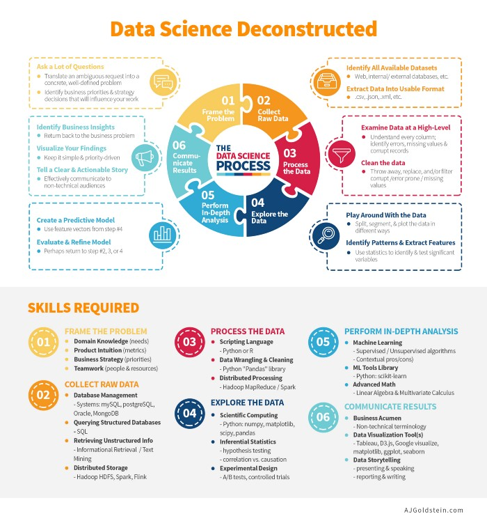

# Data Science Project Life Cycle

### 1. Obtain Data 
- Query Database
- Microsoft Excel | CSV File
- Use Python or R to Read Data from Data Source
- Relational Database (SQL) and Non Relational Database (NoSQL)
- PostgresSQL or MongoDB
- Scrap from Website using Beautiful Soup. 
- Gather Data using Web API's
- Facebook and Twitter Allow Users to Connect to their Web Servers.

### 2. Clean Data
- **Filter** the Data
- Remove Irrelevant | Incorrect | Incomplete | Improper | Duplicated | Inconsistent | Outdated | Insecure | Unformatted Data
- Convert Data from One Format to Standard Format
- If Data is Stored in Multiple CSV Files, Combine CSV Data into Single Repo.
- Fill Missing Data 
- Split | Merge | Extract Columns 
- Create New Feature from Existing One

- Improves Data Quality
- Increases Overall Productivity

### 3. Explore Data
- Once Data is Ready to be Used, Use AI and ML
- Examine the Data
- Find All need to Inspect the Data 
- Different Data Types like Numerical | Categorical | Ordinal and Nominal Data require Different Treatments.
- Compute Descriptive Statistics to Extract Features.
- Identify Patterns and Relationships
- Gain Better Picture through Charts and Graphs to Help us to Understand the Importance of the Data.
- Data Visualization helps to Find Hidden Patterns and Trends.

### 4. Model Data
- Reduce Dimensions of Data Set
- Not All Features or Values are Essential for Predicting Model.
- Select Relevant Features that Contribute to the Actual Prediction.
- Train Model to Perform Classification | Regression | Prediction | Cluster 
- Scikit Learn and Caret for Machine Learning.
- After Modelling Process, You need to Calculate Evaluation Scores
Classification : Precision | Recall | F1 Score
Regression : R^2, Measure Goodness of Fit, MAE (Mean Average Error) | RMSE (Root Mean Square Error)
- Measure Distance between Actual and Prediction.

### 5. Interpret Data
- The Predictive Power of a Model lies in its Ability to Generalize.
- How the Model Predicts | Ability to Generalize Unseen Future Data.

