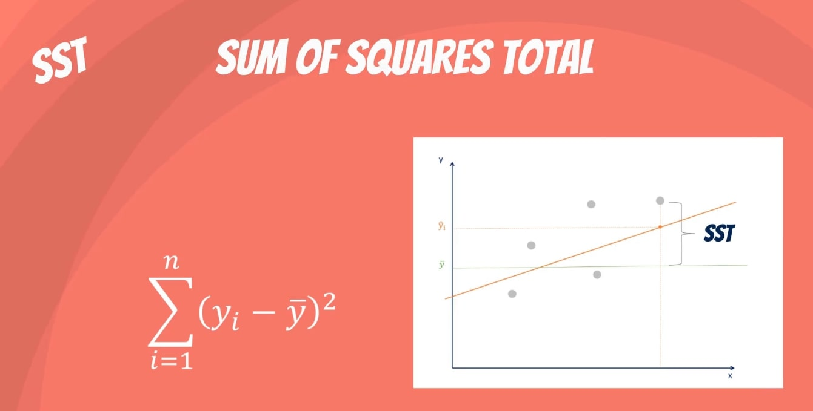

# Error in Linear Regression

### Manage Noise
- The Model created will have a lot more Errors because of Noise.
- Noise is Unwanted that **Weakens** the Learning Process of Model.

> Reasons for **Noise**
- Large Training Data Set
- Errors in Input Data 
- Data Labelling Error
- Lack of Data ( Missing Data not Handled Properly )
- Unobservable Attributes that might affect Classifications ( Sometimes **Data Visualization** helps to Find **Hidden Patterns** )

### Important Confusing Terms

1. RSS | SSE
2. ESS | SSR
3. TSS | SST
4. R Squared 

### RSS | SSE

> Residual Sum of Squares | Sum of Squares Error

- e : Error
- SSE = Sum ( Square ( Actual - Prediction ) )
- Residuals : Sum of Squares of Errors.
- Unexplained Variability.
- Variability : Distance of Actual Value from its Mean or Predicted Value.

### ESS | SSR

> Explained Sum of Squares | Sum of Squares Regression.

- Measures How well our Line Fits the Data.
- Sum ( Square ( Prediction - Mean ) )
- Explained Variability.

### TSS | SST

> Total Sum of Squares | Sum of Squares Total

- Measures Total Variability
- Explained Variability + Unexplained Variability
- Sum ( Square ( Actual - Mean ) )
- SST = SSR + SSE
- TSS = ESS + RSS

### R Squared

- Measures Goodness of Fit
- Explains Variability of Model.
- R2 = SSR / SST
- R2 = ESS / TSS
- Explained Variability / Total Variability.
- R2 ranges between 0 and 1
- R2 = 0 means our Regression Line Explains None of the Variability of the Data
- R2 = 1 means our Model Explains the Entire Variability of the Data.

### Note

- R2 = 0 or R2 = 1 is very Rare.
- R2 Actually Ranges between 0.2 to 0.9

### What is Variability ?

- How Spread Out the Data is. 
- Data Points are Distributed.  
- Far Distance with Each Other.

### How to Describe ?

1. Range
2. Interquartile range
3. Variance
4. Standard Deviation

### Range 

- Range = Max - Min

- Distance between the Largest and Smallest Data Point in a Data Set.

### Interquartile Range

- Data Set is Divided in 4 Equal Quartiles
- IQR = Q3 - Q1
- Tells where most of the Values Lies.
- Q0 = Min
- Q1 = First Quartile | 25th Percentile
- Q2 = Second Quartile | Median | 50th Percentile.
- Q3 = Third Quartile | 75th Percentile
- Q4 = Fourth Quartile | Max

### Variance

- How Spread Out Data is ?
- Small Variance = Data Set is Tight Clustered.
- Large Variance = Data Set is Spread Apart.

### Standard Deviation

- Data is Around the Mean or Away from Mean.
- Tall Bell Curve : Data is Tightly around Mean.
- Small Bell Curve : Data is Uniformely Spread.
