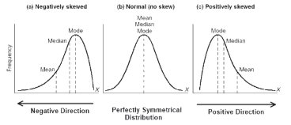

[Basic Statistics Needed for Data Science](https://towardsdatascience.com/basic-statistics-you-need-to-know-for-data-science)

# Statistics
- Science of Collecting and Analysing Numerical Data in Large Quantites.
- Gather, Review, Analyze and Draw Conclusions from Data.
- Collection, Organization, Analysis, Interpretation and Presentation of Data.

### Statistics is the Branch of Mathematics 
- Deals with Data Collection, Organization, Analysis, Interpretetion and Presentation

### Machine Learning is the Branch of Artificial Intelligence
- Uses Algorithms to Learn and Improve from Experience

### Data Types
1. Numerical : Data Expressed with Digits | Quantitative : Discrete or Continuous

2. Categorical : Data Classified in Cateories | Qualitative : Nominal (No Order) or Ordinal (Ordered Data)

### Measure Central Tendency
1. Mean : Average of Data Set (Sensitive to Outliers)

2. Median : Middle of Ordered Data Set (Less Sensitive to Outliers)

3. Mode : Most Common Value in the Data Set | Only Relevent for Discrete Data 

### Mean Deviation  

- Average of all Values from the Mean

> sum(x - x.mean()) / n

> Steps to Calculate :
1. Find Mean.  
2. Find Distance of Each Value from that Mean.
3. Find Mean of those Distances.

### Absolute Deviation
- Ignores Negative Value.

### Standard Deviation
- Measure of How Spread out Numbers are.

### Variance
- The Average of the Squared Differences from the Mean.

> N : Number of Data

> for Population : N

> for Sample : N-1

### Comparing Data 

> Univariate : One Variable (One Type of Data)

> Bivariate : Two Variables (Two Type of Data)

### Correlation 
- Relationship between two Variables

> Correlation is Positive when the Values increase together.

> Correlation is Negative when One Decreases and other Increases.

### Values can have a Value between 1 to -1
> 1 : Perfect Positive Correlation

> 0 : No Correlation

> -1 : Perfect Negative Correlation

> Close to 0 : Weak Correlation.

> Close to 1 : Strong Correlation.
