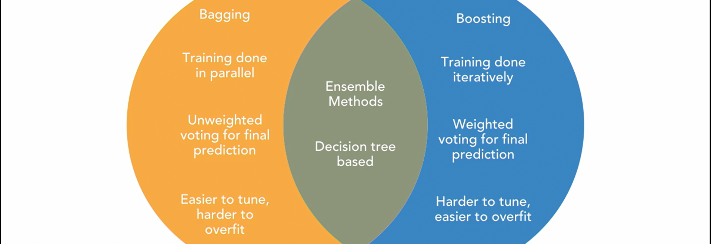
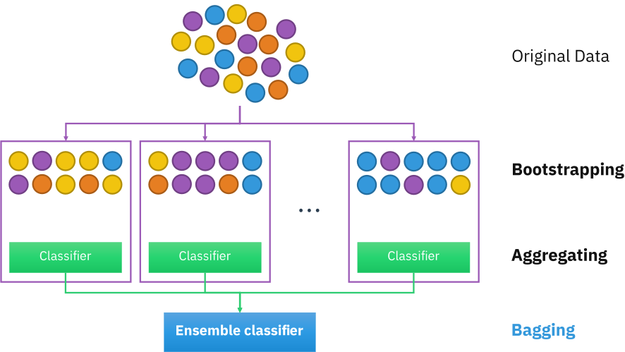
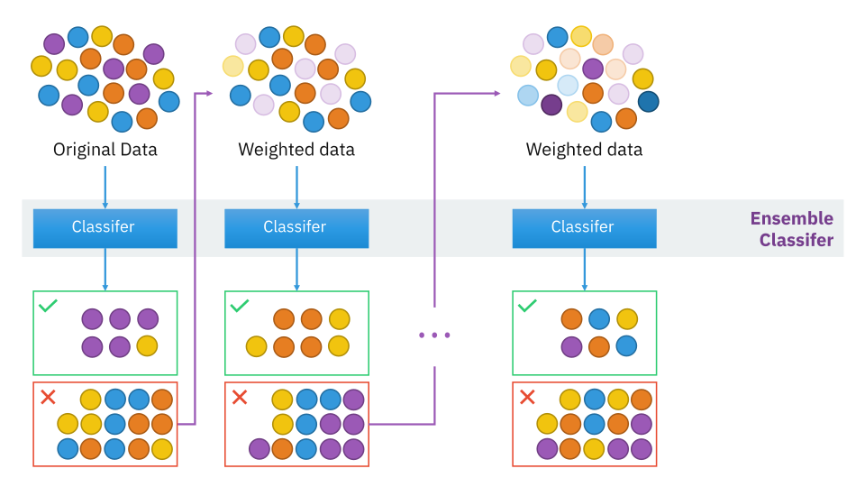

<a href='https://github.com/KIRANKUMAR7296/Library/blob/main/Machine%20Learning/Machine%20Learning%20Models.md'>Back to ML Models</a>

# Ensemble Techniques | Method

> The Combination of **Weak Learners** into one very **Accurate Prediction Algorithm** in order to Decrease **Bias** and **Variance**.

Create Multiple Models and then combine them to Produce **Better** Results ( High Accuracy ) that any Single Model **Individually**.
 
Bagging ( Bootstrap Aggregation ) | Boosting
:--- | :---
**Parallel** | **Series**
Decreases **Variance** ( Solve **Overfitting** ) | Decreases **Bias** ( Improves Training )
Each Model Receives Equal Weight | Models are Weighted based on their **Performance**
Samples Randomly | Boosting Samples by Increasing Weight for **Wrong** Predictions
Models are Built **Independently** | New Models are Improved version of Previous Built Models
Less Time to Train | More Time to Train
**Easy** to Tune | **Hard** to Tune
**Hard** to Overfit or **Least** Chance of **Overfitting** | **Easy** to Overfit
Training Data Subsets are Drawn Randomly with **Replacement** | Every New Subsets comprises the Elements that are **Missclassified** by **Previous Models**
Applied where Classifier are **Unstable** and **Complex** ( **High Variance** ) | Classifier is **Stable** and **Simple** ( **High Bias** )
Random Forest | AdaBoost ( **Ada**ptive **Boost**ing ), Gradient Boosting and XGBoost

### Benefits of Ensemble Methods

1. Used for **Classification** and **Regression**
2. Easily Handles **Outliers** and **Missing Values**
3. Accepts various types of Inputs ( **Continuous** and **Ordinal** )
4. Less likely to **Overfit**
5. Output **Feature Importance** ( Important Features for **Prediction** )

### A. Bagging (Bootstrap Aggregation)

- Dataset is divided as **Subsamples** and passed to **Multiple Base Learners**.
- **Parallel Tree** growing **Subsamples**
- Dataset is passed with **Row Sampling** with **Replacement** ( **Bootstrap** )
- Each Learning Model is **Trained** on its particular **Sample** of Data
- Voting Classifier is used to find the Final Result ( **Aggregation** )
- Combine **Weak Base Learners** into **Strong Learner** in terms of **Classifier** or **Prediction**
- Test Sample is passed to each Model for the Output
- Final Prediction is based on **Voting**
- Improves **Accuracy**

### 1. Random Forest 

- **Ensemble** Learning Method constructs a **Collection** of `Decision Trees` in `Parallel` 
- `Aggregate` the `Predictions` of each tree to **Determine** `Final Prediction`
- Dataset is divided as **Subsamples** and passed to **Multiple Base Learners** (Decision Tree)
- Training Sample consist of **Row Sampling** with **Replacement**.
- Creating Decision Tree to its complete depth may cause **Overfitting**
- But when we combine Multiple Decision Trees, **High Variance** gets converted to **Low Variance**, i.e. Reduces **Overfitting**
- Can be used for **Classification** and **Regression**
- Regressor : **Mean** or **Median** of Output of Every **Decision Trees**
- Classifier : **Majority Vote** from all **Decision Trees**.
- Easily Handles **Outliers**, **Missing Data** and **Skewness**.
- Accept **Continuous** as well as **Ordinal** Inputs.
- Help to Understand **Important Features**. ( Parameter : `feature_importance` )
- Works Good even if the Data is Messy ( Missing Values or Outliers )  

### B. Boosting

- An Ensemble Method that **Aggregates** a number of Weak Methods to Create one **Strong Model**
- Boosting effectively Learns from its Mistake with each Iteration
- Decision Trees are Created with only **One Depth** or only **One Split** ( **Stumps** )
- Base Learners | Weak Learners are Created **Sequentially** and the **Subsamples** are passed for Training
- Samples are Created using **Row Sampling** and **Column Sampling**
- Boosting combines **Weak Learners Sequentially** by correcting **Previous Errors** ( Forcing them to Improve )
- **Weight** is attached with each and every **Instance** | Row | Record
- If the portion of Dataset is incorrectly classified then that portion is transfered to next **Base Learner** for Training again
- Weights are **Adjusted** before each Training and Miss Classified Instances are focused with High Priority
- Test Sample is passed to each Model for the Output

### 1. ADABOOST

- In ADABOOST **Weights** is assigned with **Incorrect Values** in Samples.
- **Sequential Tree** growing  with **Weighted Samples**.
- Base Learners are **Decision Trees**.
- Decision Trees are Created with only **One Depth** or only **One Split** (**Stumps**)
- The Stump will **Low Entrophy** or **High Information Gain** is Selected First
- ADABOOST allow us to capture **Non Linear Relationships**

### 2. Gradient Boosting
- Uses the **Loss Function** of Base Model ( **Decision Tree** ) for minimizing the **Error** of overall Model
- An **Iterative** Approach
- **Combine** Weak Learners to Create a **Strong** Learner by Focusing on Mistakes of Prior Iterations

### 3. XGBoost | Extreme Gradient Boosting
- Uses **2**nd Order **Partial Derivative** for Approximation
- Choose a Better **Learning Rate** that suits our Model

### Hard Voting vs Soft Voting

- Hard Voting : **Majority Voting** is more important
- Soft Voting : **Predictive Probability** of Class is important, **Mean** of Probability is Calculated for each Class

### Activation Function
- A Function that takes in the **Weighted Sum** of all the Inputs from **Previous Layer** ( + Adds **Bias** ) and Generates Output for **Next Layer**
