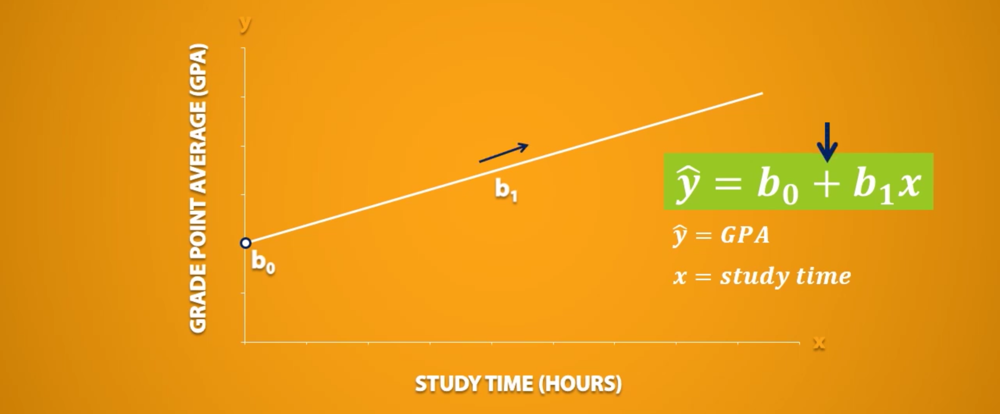
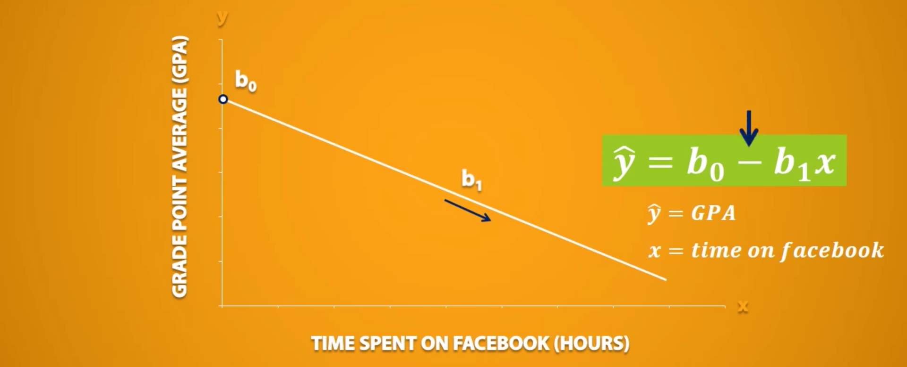

# Linear Regression 📈

**Learning** a Linear Regression Model means Estimating the Values of the **Coefficient** 

**Predict** the Value of a **Feature** based on the Value of Another Feature.

### Y = X * B1 + B0

### B1 : Slope 
- Gradient | **Steepness** in Line | **Direction** of Line | **Weight**

### B0 : Intercept 
- Bias | Constant | The Place where **Regression Line** Intersects the Y Axis (Value of Y when X = 0)

### R2 : Coefficient of Determination

- The **Variance** of the Data captured by the Model (0.7 to 0.9 is Good value for R2) 
- Larger R2 indicates a Better Fit (The Model can Explain the Variation of Predictions with Actual in much Better Way)
- R2 = 1 corresponds to SSR = 0 (**Perfect Fit**) 
- Low R2 causes **Underfitting**
- High R2 resultss into **Overfitting**

### Residuals 
- Actual - Prediction

### Simple Linear Regression
- Single Input | Independent Feature 
- Use Statistics to Estimate Coefficients
- Mean | Median | Standard Deviations | Correlation and Covariance

### Ordinary Least Squares (OLS)
- More than One Independent Features
- Minimize the Sum of Squared Residuals | Errors 
- Sum(Square(Distance between the Actual Data Point and the Predicted Point (Regression Line)))
- Treat Data as Matrix
- Use Linear Algebra to Estimate | Predict the Optimal Value for the Coefficients.

### Gradient Descent
- A Process of Optimizing the Values of the Coefficients by Iteratively Minimizing the **Error** of Model on Training Data.
- Starts with Random Values for each Coefficient
- Sum of Squared Errors (**SSE**) are Calculated for each Pair of Independent and Dependent Values.
- **Learning Rate** is used as a Scale and the coefficients are updated in the direction towards minimizing the Error.
- The Process is Repeated until a minimum SSE is Achieved or no further improvement is possible.
- Learning Rate (alpha) Parameters that determines the size of Improvement Step on each Iteration.

### Regularization
- Seek to Minimize SSE of the Model on Training Data 
- Reduce **Complexity** of Model (**Overfitting**)
- Add some Bias on Training Data for Decreasing Variance on Test Data 

1. **LASSO** (L1) : OLS is modified to minimize the **Absolute** Sum of Coefficients : Cost Function + (Lambda) * |Slope|
2. **Ridge** (L2) : OLS is modified to minimize the **Squared** Sum of Coefficients : Cost Function + (Lambda) * Square(Slope)

Used when there is Collinearity (One Independent Feature can completely Describe Other Independent Feature) in Data 

# Preparing Data for Linear Regression

### 1. Linear Assumptions
- Independent Features and Dependent Features should be Continuous.
- The Relationship between Independent and Dependent Features should be **Linear**.
- You may need to **Transform** Data to make the Relationship **Linear**.
- Data needs to Show **Homoscedasticity** (Variance along the Line of **Best Fit** remains similar as you move along the line)
- Observations should be Independent.

### 2. Remove Noise 
- Remove **Outliers** 

### 3. Remove Collinearity
- If Independent Features are Highly Correlated, Linear Regression will Over Fit your Data.
- Pairwise Correlations for Independent Features and Remove the Correlated.

### 4. Gaussian Distributions
- More Reliable Predictions.
- Using **Transform** makes Data more Gaussian.

### 5. Rescale Independent Features
- Rescale Independent Features for more Reliable Predictions
- Use **Standardization** or **Normalization**

### 6. Residuals 
- Check the **Residual** | **Error** of the Regression Line.
- Should be as low as Possible (Complete Removal of Error is Impossible)
- The Distribution of the Data should be **Normally** Distributed.
