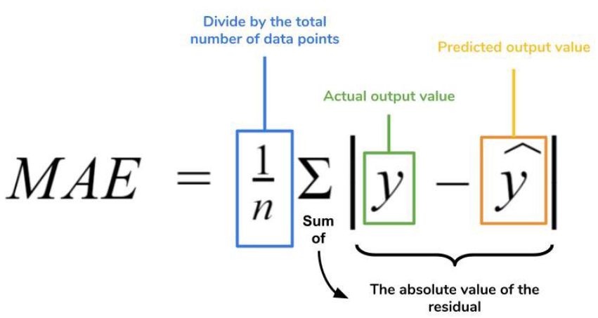
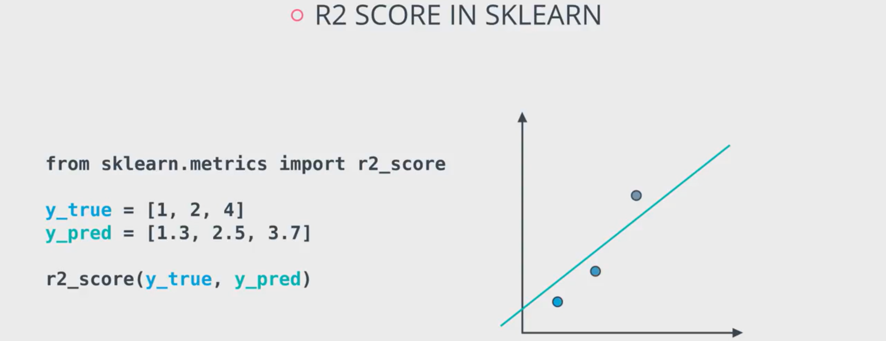
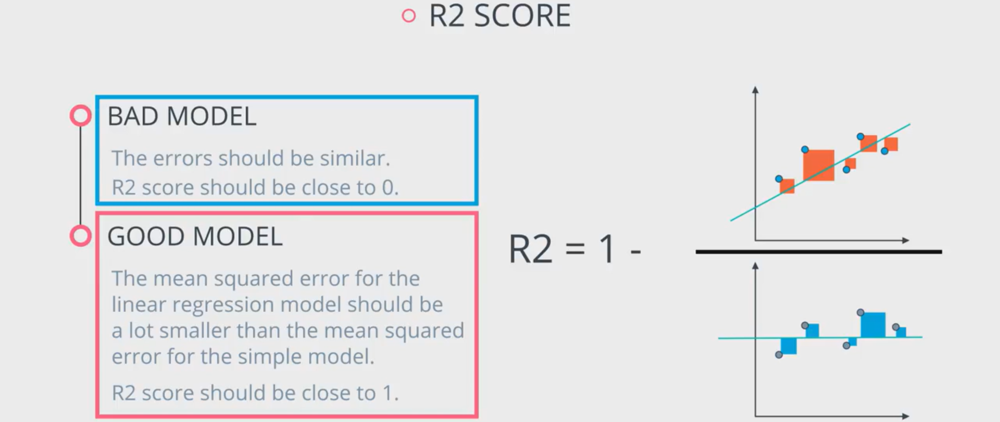
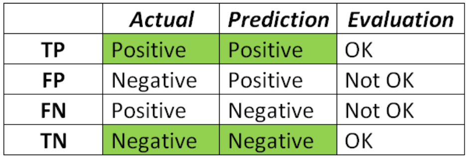
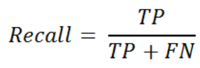

# Regression Metrics 🧮

1. We **Start** with some Initial Configuration of Model and `Predict` the **Output** based on some **Input**.
2. Predicted Value is compared with the `Target` and Measure the `Performance` of our Model.
3. Various Parameters of the Model are `Adjusted Iteratively` in order to reach the **Optimal Value** of the **Performance Metric**.

### Linear Regression
- `Predict` **Dependent Variable** on the basis of One or more **Independent** Variable ( s )

### 1. Mean Absolute Error ( `MAE` )

- Absolute Difference between `Actual` Value and `Predicted` Value.
- MAE is better for **Outliers** 
- All **Individual Differences** are weighted equally
- `Fails` in case of **Large Errors**

### 2. Mean Squared Error ( `MSE` ) 

- Squared Difference between the `Actual` Value and the `Predicted` Value
- Square the Differences, Penalizes even Samll Error

### 3. Root Mean Square Error ( `RMSE` )

- Square Root of MSE
- RMSE is useful when `Large` Errors are Undesired

### 4. Coefficient of Determination ( R2 )

- Square of `Correlation`
- Help us to `Compare` **Current** Model with the **Base** Model

- R2 is always <= 1 

### 5. Adjusted R2
- Improvement of R2
- Adjusted R2 is always `lower` than R2

| MAE or MSE or RMSE | R2 |
| :--- | :--- |
| Good Model : Value closer to Zero | Good Model : Value closer to One |
| Perfect Model : Value == 0 | Perfect Model : Value == 1 |

### Logistic Regression
- `Predict` the `Class` | `Label` of a **Data Point** on the basis of One or more **Independent Features**.
- Depending on the number of `Class` | `Label` that **Target Variable** includes, it can be `Binary` or `Multi Class` **Classification**.

> Data Set should contain Well `Balanced` **Class Distribution**

> **Good Classifier** : `1 or 100%` | **Bad Classifier** < `0.5 or 50%`

### 1. Confusion Matrix
- Show `Correct` and `Incorrect` Predictions | Classifications on each **Class** | **Label**

- **True Positive** ( `TP` ) : Predicts 1 when Actual is 1
- **True Negative** ( `TN` ) : Predicts 0 when Actual is 0
- **False Positive** ( `FP` ) : Predicts 1 when Actual is 0 ( `Type I` Error | Incorrect **True Prediction** )
- **False Negative** ( `FN` ) : Predicts 0 when Actual is 1 ( `Type II` Error | Incorrect **False Prediction** )

> **FP** is `Acceptable` but **FN** is Dangerous | Fatal for Problems related to **Medical Field**

### 2. Classification Accuracy 
- Number of `Correct` Prediction to the Number of **Total Predictions**
- Accuracy Score is Good if Datasets contains well `Balanced` Class Distribution

### 3. Precision
- Focus on `Positive Predictions` ( How Good our Model is when **Prediction** is `Positive` ? )
- **Evaluates** Model only based on `Positive Predictions`

### 4. Recall | True Positive Rate ( `TPR` ) | Sensitivity
- Focus on `Positive Class` ( How Good our Model is at `Correctly` predicting `Positive` Classes ? )
- **Evaluates** Model only based on its **ability** to  **Predict** the `Positive Class`
- **True Positive Rate** : Proportion of **Positive Class** that is `Correctly` Predicted as **Positive**

### 4. False Positive Rate ( `FPR` ) | Specificity
- Focus on `Negative Class` ( How Good our Model is at `Correctly` predicting `Negative` Classes ? )
- **Evaluates** Model only based on its **ability** to  **Predict** the `Negative Class`
- **False Positive Rate** : Proportion of **Negative Class** that is `Correctly` Predicted as **Negative**

### 6. F1 Score
- Weighted Average of **Precision** and **Recall**
- Useful for Datasets with `Uneven` | `Imbalanced` **Class Distribution**
- It considers `FP` and `FN`
- `Best` Value for **F1 Score** is `1`
- `Worst` Value for **F1 Score** is `0`

### 7. ROC Curve
- Receiver Operating Characteristic Curve
- Y Axis : True Positive Rate ( `TPR` )
- X Axis : False Positive Rate ( `FPR` )
- Plots TPR vs FPR at Different Classification `Thresholds`

### 8. AUC 
- `Area` Under **ROC Curve**
- Shows the `Performance` of a Classification Model across all Classification `Thresholds`.
- Worst Classifier : AUC < 0.5
- Bad Classifier : 0.5 | **50%**
- Good Classifier : 0.9 | **90%**
- Perfect Classifier : 1.0 | **100%**

