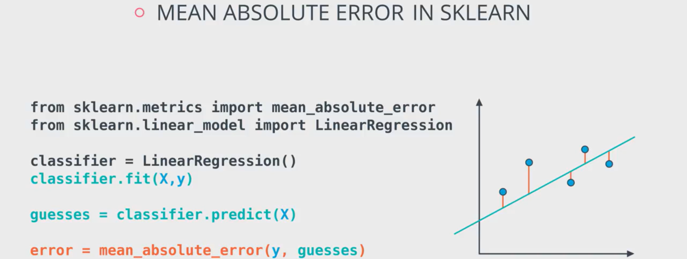
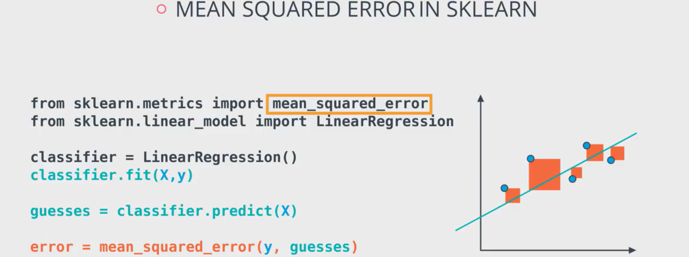
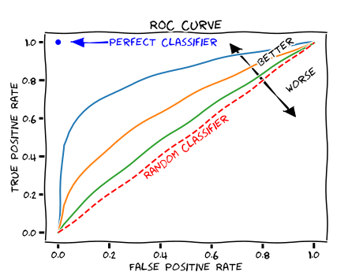

<a align="right" href="https://github.com/KIRANKUMAR7296/Library/blob/main/Interview.md">Back to Questions</a>

# Regression Metrics 🧮

<table align=center>
  <tr><th colspan=2><h3>Metrics</h3></th></tr>
  <tr>
    <td><h3>Regression :</h3>
      <ol>
        <li>Mean Absolute Error ( <a href='#mae'>MAE</a> )</li>
        <li>Mean Squared Error ( <a href='#mse'>MSE</a> )</li>
        <li>Room Mean Squared Error ( <a href='#rmse'>RMSE</a> )</li>
        <li>Coefficient of Determination ( <a href='#r2'>R2</a> )</li>
        <li>Adjusted R2 ( <a href='#ar2'>Adj R2</a> )</li>
      </ol>
    </td>
    <td><h3>Classification :</h3>
       <ol>
        <li><a href='#cm'>Confusion Matrix</a></li>
        <li><a href='#acc'>Accuracy</a></li>
        <li><a href='#pre'>Precision</a></li>
        <li>Recall | <a href='#tpr'>FPR</a> | Sensitivity</li>
        <li><a href='#fpr'>FPR</a> | Specificity</li>
        <li><a href='#f1'>F1 Score</a></li>
        <li><a href='#roc'>ROC</a></li>
        <li><a href='#auc'>AUC</a></li>
      </ol>
    </td>
  </tr>
</table>

<a href="#linear"> <h3> Linear Regression </h3> </a> 

<a href="#logistic"> <h3> Logistic Regression | Classification </h3> </a>

1. We **Start** with some Initial Configuration of Model and `Predict` the **Output** based on some **Input**.
2. Predicted Value is compared with the `Target` and Measure the `Performance` of our Model.
3. Various Parameters of the Model are `Adjusted Iteratively` in order to reach the **Optimal Value** of the **Performance Metric**.

<h3 name="linear">Linear Regression</h3>

- `Predict` **Dependent Variable** on the basis of One or more **Independent** Variable ( s )

<h3 name='mae'>1. Mean Absolute Error ( MAE ) </h3>

- Absolute Difference between `Actual` Value and `Predicted` Value.
- MAE is better for **Outliers** 
- All **Individual Differences** are weighted equally
- `Fails` in case of **Large Errors**

<h3 name='mse'>2. Mean Squared Error ( MSE ) | LOSS</h3>

- Squared Difference between the `Actual` Value and the `Predicted` Value
- Square the Differences, Penalizes even Samll Error

<h3 name='rmse'>3. Root Mean Square Error ( RMSE )</h3>

- Square Root of MSE
- RMSE is useful when `Large` Errors are Undesired

<h3 name='r2'>4. Coefficient of Determination ( R2 ) | Squared Correlation Coefficient</h3>

- Helps to Understand How well the Model Fits the Data and How well the Model Predicts New Observations.
- Ideal Value for R2 is between 70% to 90% ( Model Fits the Data very Well )
- Help us to `Compare` **Current** Model with the **Base** Model

<h3 name='ar2'>5. Adjusted R2</h3>

- Improvement of R2 ( Adjusted R2 is always `lower` than R2 )
- Compare Models with different number of **Predictors** | **Independent Features**.
- Adjusted R2 **Increases** only if the New Term ( Independent Feature ) improves the Model **More** than Expected.
- Adjusted R2 **Decreases** if the New Term ( Independent Feature ) improves the Model **Less** than Expected.
- **More Accurate Correlation** between Variables.

| MAE or MSE or RMSE | R2 | R2 ( Adj )
| :--- | :--- | :---
| Good Model : Value closer to Zero | Good Model : Value closer to One | Increases only if New Term Improves Model More
| Perfect Model : Value == 0 | Perfect Model : Value == 1 | Decreases if New Term does not Improves Model Well

<h3 name="logistic">Logistic Regression | Classification</h3>

- `Predict` the `Class` | `Label` of a **Data Point** on the basis of One or more **Independent Features**.
- Depending on the number of `Class` | `Label` that **Target Variable** includes, it can be `Binary` or `Multi Class` **Classification**.

> Data Set should contain Well `Balanced` **Class Distribution**

> **Good Classifier** : `1 or 100%` | **Bad Classifier** < `0.5 or 50%`

<h3 name='cm'>1. Confusion Matrix</h3>

- Show `Correct` and `Incorrect` Predictions | Classifications on each **Class** | **Label**

- **True Positive** ( `TP` ) : Predicts `1` | `Positive` when Actual is `1` | `Positive` 
- **True Negative** ( `TN` ) : Predicts `0` | `Negative` when Actual is `0` | `Negative` 
- **False Positive** ( `FP` ) : Predicts `1` | `Positive` when Actual is `0` | `Negative` ( `Type I` Error | Incorrect **True Prediction** )
- **False Negative** ( `FN` ) : Predicts `0` | `Negative` when Actual is `1` | `Positive` ( `Type II` Error | Incorrect **False Prediction** )

> **FP** is `Acceptable` but **FN** is Dangerous | Fatal for Problems related to **Medical Field**

<h3 name='acc'>2. Accuracy</h3>

- Number of `Correct` Prediction to the Number of **Total Predictions**
- Accuracy Score is Good if Datasets contains well `Balanced` Class Distribution
- Used when All the Classes ( TP, TN, FP and FN ) are Equally Important.

<h3 name='pre'>3. Precision</h3>

- Focus on `Positive Predictions` ( How Good our Model is when **Prediction** is `Positive` ? )
- Measures the **Correctly** Identified Positive Cases from all the **Predicted** Positive Cases.
- Used when the Costs of False Positives is **High**. ( e.g. There is Virus but still Antivirus is Predicting that the System is Safe it's Costly )
- **Evaluates** Model only based on `Positive Predictions`

<h3 name='tpr'>4. Recall | True Positive Rate ( TPR ) | Sensitivity</h3>

- Focus on `Positive Class` ( How Good our Model is at `Correctly` predicting `Positive` Classes ? )
- **Evaluates** Model only based on its **ability** to  **Predict** the `Positive Class`
- Measures the Correctly identified Positive Cases from all the **Actual Positive Cases**. 
- Used when the Cost of False Negatives is **High**. ( e.g. Person is Really prone to COVID 19 but Test Result is Negative it can be Fatal. )
- **True Positive Rate** : Proportion of **Positive Class** that is `Correctly` Predicted as **Positive**

<h3 name='fpr'>5. False Positive Rate ( FPR ) | Specificity</h3>

- Focus on `Negative Class` ( How Good our Model is at `Correctly` predicting `Negative` Classes ? )
- **Evaluates** Model only based on its **ability** to  **Predict** the `Negative Class`
- **False Positive Rate** : Proportion of **Negative Class** that is `Correctly` Predicted as **Negative**

### **Precision**, **TPR** and **FPR** is a Better Metric for Imbalanced Data Set because it **Focus** on only **One Class**.

<h3 name='f1'>6. F1 Score</h3>

- Weighted Average ( Harmonic Mean ) of **Precision** and **Recall**
- Useful for Datasets with `Uneven` | `Imbalanced` **Class Distribution** and it also considers FP and FN.
- A Better Measure for the Incorrectly Classified Cases than the Accuracy Metric.
- Accuracy is used when TP and TN are more Important and F1 Score is used when FN and FP are more **Crucial**.
- **F1-score** is a Better Metric to Evaluate in **Real Life Application**.
- F1 Score Keeps a Balance between Recall and Precision for the Classifier | Model.
- `Best` Value for **F1 Score** is `1` | `Worst` Value for **F1 Score** is `0`

> **Precision**, **Recall** and **F1 Score** are better `Metrics` for **Imbalanced Dataset**

<h3 name='roc'>7. ROC Curve</h3>

- Receiver Operating Characteristic Curve
- Y Axis : True Positive Rate ( `TPR` )
- X Axis : False Positive Rate ( `FPR` )
- Plots TPR vs FPR at Different Classification `Thresholds`
- If Threshold is near to `1.0` or `100%`: **Classifications** gets more **Accurate**.

> ROC helps to Understand **Characteristics** of Curve by plotting TPR on Y Axis and FPR on X Axis at different Classification **Thresholds**.

<h3 name='auc'>8. AUC | Area Under ROC Curve</h3> 

- Helps to Understand the `Performance` of a Classification Model across all Classification `Thresholds`.
- AUC = 1.0 ( **Perfect** Classifier ) | AUC > 0.75 ( **Good** Classifier ) | AUC : **50%** ( **Bad** Classifier ) | AUC < 0.5 ( **Worst** Classifier )

<a align="right" href="https://github.com/KIRANKUMAR7296/Library/blob/main/Interview.md">Back to Questions</a>

