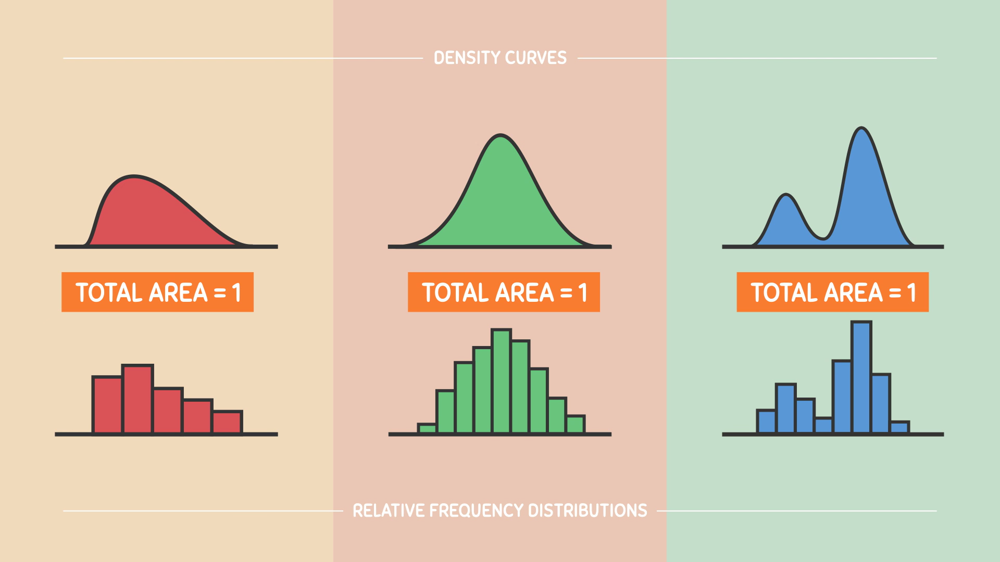
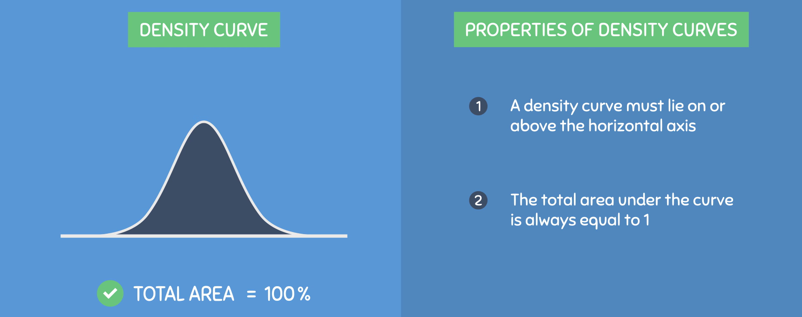
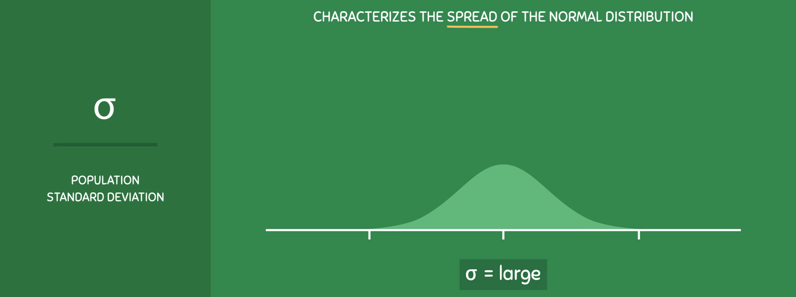
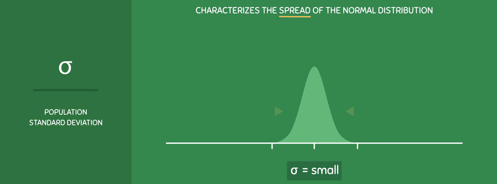
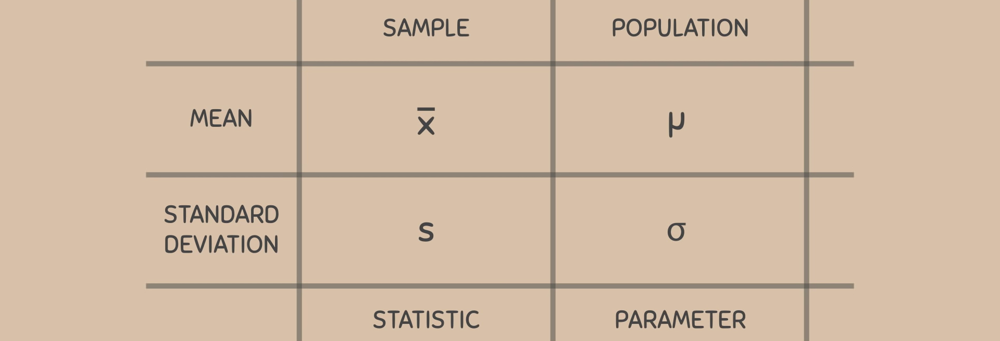
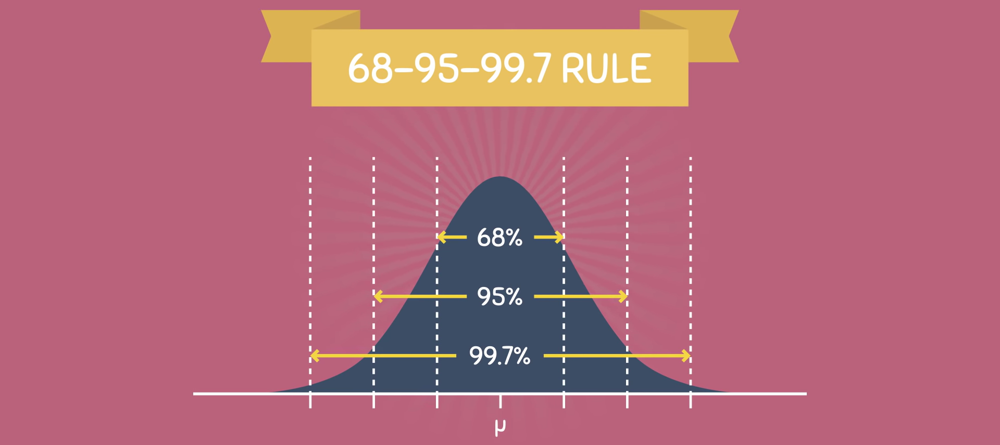
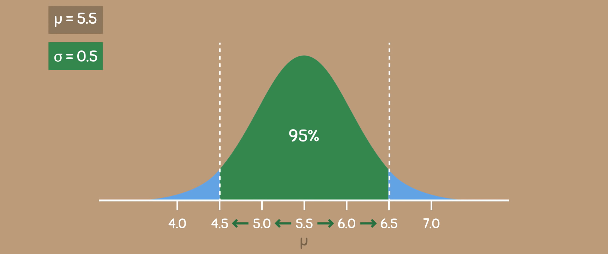
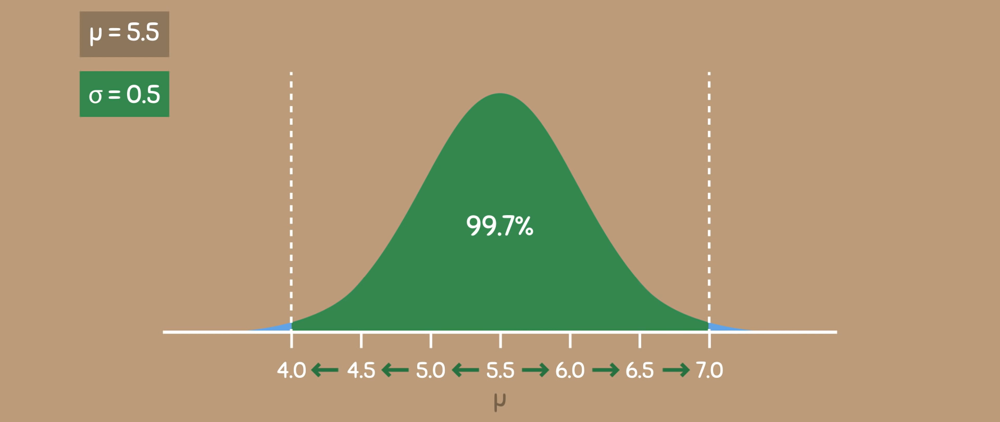
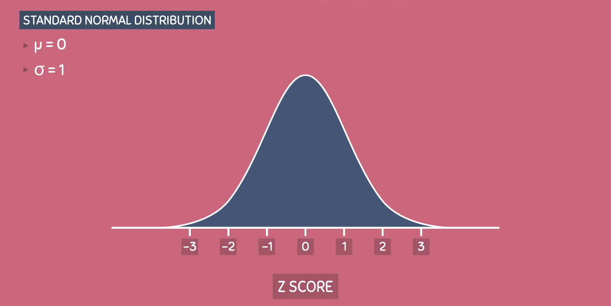
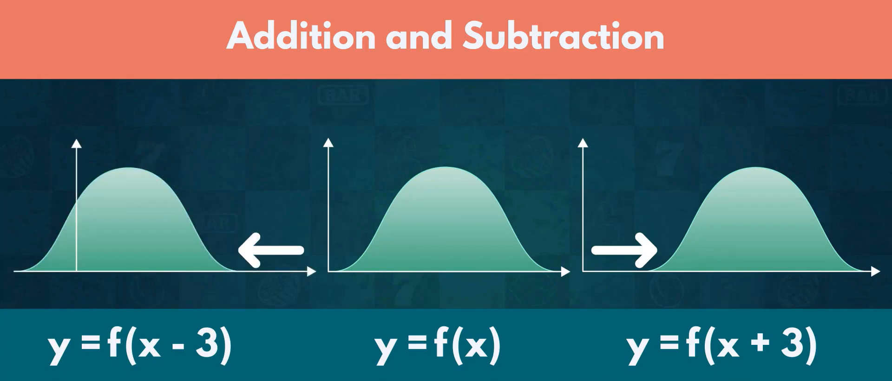

# Types of **Distribution**.

<h3> Discrete :&nbsp; <a href='#uniform'>Uniform</a>&nbsp; |&nbsp; <a href='#bernoulli'>Bernoulli</a>&nbsp; |&nbsp; <a href='#binomial'>Binomial</a>&nbsp; |&nbsp; <a href='#poisson'>Poisson</a></h3>

<h3> Continuous :&nbsp; <a href='#normal'>Normal</a>&nbsp; |&nbsp; <a href='#std'>Standard Normal</a>&nbsp; |&nbsp; <a href='#t'>T</a>&nbsp; |&nbsp; <a href='#chi'>Chi2</a></h3>

# Density Curve

> **Density Curve** helps us to **Visualize** the overall shape of a distribution. 

- We use **Histogram** to represent **Frequency Distribution** of Data ( Number of Data Points in given **Intervals** )

- **Regular Frequency Distribution** can be converted into **Relative Frequency Distribution** ( **Proportion** | **Percentage** )

- Relative Frequency Distribution : **Divide** Each Interval **Data Points** with **Total** Number of Data Points in a Dataset.

- **Total Area** of any type of **Distribution** is always **1** or **100%**

> Density Curve gives a better Picture about how the Dataset is distributed. 

## Discrete Events.

- **Finite** number of outcomes : Die | Picking a Card : 

<h3 name='uniform'>1. Uniform Distribution</h3>

- **X ~ U ( 3 , 7 )**
- Variable **X** follows an **Uniform Distribution** ranging from 3 to 7.
- Events with **Finite** outcomes. 
- All the outcomes have Equal | **Same** Probability. 
- Flip a Coin ( H | T )
- Roll a Dice ( 1 | 2 | 3 | 4 | 5 | 6 )

<h3 name='bernoulli'>2. Bernoulli Distribution</h3>

- **X ~ Bern ( p )**
- Variable **X** follows a **Bernoulli Distribution** with **p** ( probability | likelihood ) of success. 
- Event with only 1 Trial and 2 Possible Outcomes ( True or False | Yes or No | 1 or 0 ) 
- We know the **Probability** of Outcome.
- If probability of one outcome is **p**(1) the probability of an other outcome is **1 - p**(0).
- E ( X ) = p or ( 1 - p ) | p > 1 - p
- **Expected Outcome** Probability of X : **p** | **Alternative Outcome** : **1 - p**
- Variance : p * ( 1 - p )
- A Coin flip | A Single True or False Question | Vote between 2 Parties.

<h3 name='binomial'>3. Binomial Distribution</h3>

- **X ~ B ( n , p )**
- Variable **X** follows a **Binomial Distribution** with **n** trials and **p** ( probability | likelihood ) of success in each **Individual Trial**.
- **Sequence** | **Trials** of **Identical Bernoulli Events**.
- Flipping a Coin **Twice** | Rolling two Dies | Quiz of 10 True or False Questions.

<h3 name='poisson'>4. Poisson Distribution</h3>

- **X ~ Po ( lambda )** 
- Number of **Occurences**.
- lambda : **Frequency** with which an **Event** happens or not within a specific interval of **Time**. 
- Number of **Goals** in Football | Number of **Baskets** in Basketball.
- e.g. a Fire Fly lights up 3 times in 10 Seconds.

## Continuous Events.

- **Infinite** number of outcomes : Time | Distance : 

<h3 name='normal'> 1. Normal Distribution | Gaussian Distribution | Bell Shaped Curve</h3>

- **X ~ N ( mean, variance )** 
- Variable **X** follows a **Normal Distribution** with **Mean** and **Variance**. 
- Normal Events in Nature. 
- Average Height of Person ( **Exceptions** are considered as **Outliers** ).
- Majority of Data is centered around **Mean**.
- **Mean** = **Median** = **Mode** are Exactly the `Same`

- Graph is **Symmetric** around **Mean**.

### 68, 95, 99.7 Law |  Empirical Rule

- Around `68%` of values are within `1` **Standard Deviation** from the **Mean**
- Around `95%` of values are within `2` **Standard Deviations** from the **Mean**
- Around `99.7%` of values are within `3` **Standard Deviations** from the **Mean**

- **68 %** of Outcomes fall withins **1** Standard Deviation

- **95 %** of Outcomes fall withins **2** Standard Deviation

- **99.7 %** of Outcomes fall withins **3** Standard Deviation
- **Outliers** are **Extremely Rare** in Normal Distribution.

<h3 name='std'>2. Standard Normal Distribution</h3> 

- **X ~ N ( mean = 0 , variance = 1 )** 
- Variable **X** follows a **Normal Distribution** with **Mean** = 0 and **Variance** = 1. 

- Each Number on **Horizontal Axis** represents **Z Score**.

- Standardization

- Moving Graph to the Left or Right until Mean = 0.
- **Transformation** : **Alter** every elements of a **Distribution** to get **New Distribution**.
- Z = X - Mean / Standard Deviation.

- **Addition** and **Subtraction** will move the Distribution on **X Axis** to **Left** or **Right**.

- **Multiplication** and **Division** will **Contract** or **Expand** on **Y Axis**.

<h3 name='t'>3. T Distribution</h3>

- **X ~ t ( k )** 
- Variable **X** follows a **t Distribution** with k **Degree of Freedom**.
- Most Observations falls close to **Mean**
- Rest Observations make up the **Tails** on either side.
- A Normal Distrbution used for **Small Sample Size**.
- Used for **Hypothesis Testing** with **Limited Data**.
- **Variance** in the Data is **Unknown**.
- Tails are Fat at the both ends.

<h3 name='chi'>4. Chi Squared Distribution</h3>  

- **X ~ chi2 ( k )** 
- Variable **X** follows a **chi2 Distribution** with k **Degree of Freedom**.
- E( X ) = k
- Var ( X ) = 2k
- Few Events in Real Life.
- Used in **Statistical Analysis** ( **Hypothesis Testing** and Computing **Confidence Intervals** ).
- Determine the **Goodness of Fitness**.
- Distribution ( **X Axis** ) Starts from **Zero** and **Asymmetric** in Nature.
- It is Squared therefore only **Positive**.
- Rapid changing Event follows **Exponential Distribution**.
- Forecast and Prediction Events follows **Logistic Distribution**. (Which Team will Win, Weather Forecast)

